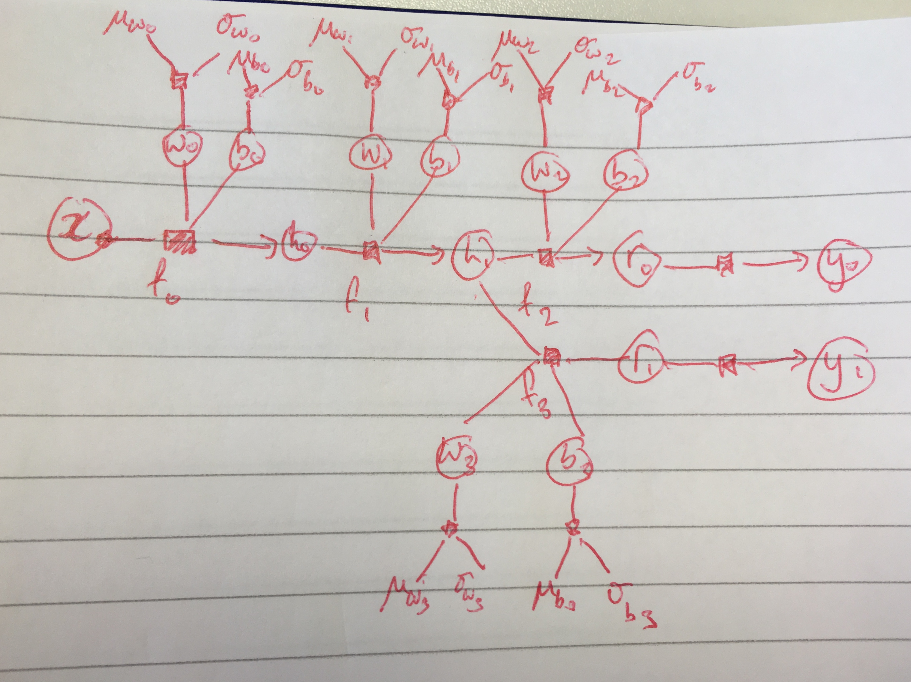

# Adding the ability to ignore certain variables during inference

Tom Diethe (2018-11-26)

## Motivation

In the current design, variables are either latent or observed. By default, when creating posteriors, any variables that are not observed are then included in the model, which in certain situations can have undesired effects. 

Consider the following model depicted as a directed factor graph:



Here we have a multi-head (two heads in this case) Bayesian neural network model. For simplicity this is drawn as having one-dimensional inputs and outputs and hence all variables in the graph are also one-dimensional. 

Note that the model assumes here that there are different "prediction tasks", but that the input variable is shared between the tasks. To be concrete, at any particular episode, we only observe data for one of these tasks, e.g. for the first task this will be a tuple of the form `(x, y0)` where these are arrays of `N` data points, and for the second task this will be `(x ,y1)`. When performing inference over the latent variables in either of these scenarios, we will have no observations for the variables in the complement - i.e. in this setting for the first task we will wish to ignore the variables `r1, y1` completely. Note that they have no impact on the joint distribution.

Including the variable `N` for the number of data points there are `14 + 8 * h` variables in the model (where `h` is the number of heads), and we wish to have `12 + 6 * h` variables in the posterior, since we will have variables for each of the weights, biases, and their respective `µ` and `σ` variables. 

The current design of the interface for creating a posterior distribution does not allow for variables to be ignored in this manner. For example, if we use the Gaussian mean-field posterior, the logic is as follows:

```python
def create_Gaussian_meanfield(model, observed, dtype=None):
    dtype = get_default_dtype() if dtype is None else dtype
    observed = variables_to_UUID(observed)
    q = Posterior(model)
    for v in model.variables.values():
        if v.type == VariableType.RANDVAR and v not in observed:
            mean = Variable(shape=v.shape)
            variance = Variable(shape=v.shape,
                                transformation=PositiveTransformation())
            q[v].set_prior(Normal(mean=mean, variance=variance, dtype=dtype))
    return q
```

For the model depicted above, we have the following pattern of observations:

```python
observed = [model.x, model.y0]
```
 
and we end up with an additional variable for the head not being used (e.g. `y1` when observing `y0`). This then causes issues in the subsequent inference.
 

## Proposed Changes

One way to solve this is to have a to pass in a list of variables that are to be ignored when creating the posteriors, and then another list of variables. 
As an example, for the Gaussian mean-field posterior example we could do the following: 

```python
def create_Gaussian_meanfield(model, observed, ignored=None, dtype=None):
    dtype = get_default_dtype() if dtype is None else dtype
    observed = variables_to_UUID(observed)
    ignored = variables_to_UUID(ignored) if ignored is not None else []
    q = Posterior(model)
    for v in model.variables.values():
        if v.type == VariableType.RANDVAR and v not in observed and v not in ignored:
            mean = Variable(shape=v.shape)
            variance = Variable(shape=v.shape,
                                transformation=PositiveTransformation())
            q[v].set_prior(Normal(mean=mean, variance=variance, dtype=dtype))
    return q
```

We would then specify:

```python
observed = [model.x, model.y0]
ignored = [model.y1]
```

Similarly, for the inference, would augment the keyword arguments to include these variables. i.e.:

```python
kwargs = dict(x=x, y0=y, ignored=[model.y1, model.r1])
inference.run(max_iter=max_iter, learning_rate=learning_rate, verbose=False, callback=print_status, **kwargs)
```

Note here that we have additionally specified that the parent of `y1`, `r1`, should also be ignored. In terms of the Machine Learning algorithm, this would then be estimating the posterior:

```
p(Θ, r0, r1 | x, y0, y1) = p(Θ, r0 | x, y0) ∝ p(x, y0 , r0| Θ) p(Θ) 
```

where `Θ` denotes all of the weights and biases collected together.

## Rejected Alternatives

A possible solution is to have a flag set on the variable itself (default to `False`) saying that this variable should be ignored. 
Drawbacks of this approach:
- need to keep track of the flag in multiple places
- if we want to "unset" the flag, the inference algorithms would also need to be told about the un-setting (e.g. if warm-starting inference) 
